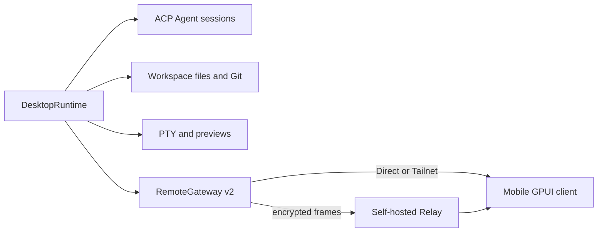

Vibex 通过“单一权威运行时 + 类型化投影”让多个原生客户端保持一致。不要在移动端、Relay 或 UI 层创建第二份权威业务状态。

## 运行时关系

## 主要 crate

| 层 | 职责 |
| --- | --- |
| `crates/core` | 序列化 id、DTO、错误、能力和远程协议契约。 |
| `crates/desktop-model` | 与框架无关的会话、时间线投影和 reducer。 |
| `crates/vibex-backend` | 原生与远程适配器共用的供应商无关能力 facade。 |
| `crates/vibex-ui` | 语义 token、可移植组件模型和工作流控制器。 |
| `crates/vibex-remote-client` | 配对、重连、同步和 Direct/Tailnet/Relay 路由。 |
| `apps/desktop` | 原生工作台和 `DesktopRuntime`。 |
| `apps/mobile` | 将共享远程投影组合成 Android/iOS 原生界面。 |
| `apps/relay-server` | 转发不透明的加密 WebSocket 帧。 |

## 数据流规则

事件带有权威序号和版本。客户端检测到 generation 或 cursor gap 时必须返回 `resync_required`，然后从桌面端重新获取。文件写入还要遵循内容修订和 compare-and-swap（CAS）检查。

远程附件在建立流前重新认证和授权。终端输入带工作区作用域、代数检查和审计；不要保存原始终端字节。

## 持久化和恢复

SQLite 保存项目、工作区、会话、时间线、Provider、终端元数据和远程设备。`running` 不是进程仍存活的证明；重启后必须根据事实重新探测，丢失终端标记为 stale。

## 变更评审清单

- 是否仍由桌面端拥有唯一真相？
- 是否使用共享 DTO、错误和能力，而不是复制结构？
- 是否为重连、序号间隙、撤销和恢复定义行为？
- 是否脱敏日志、截图和测试证据？
