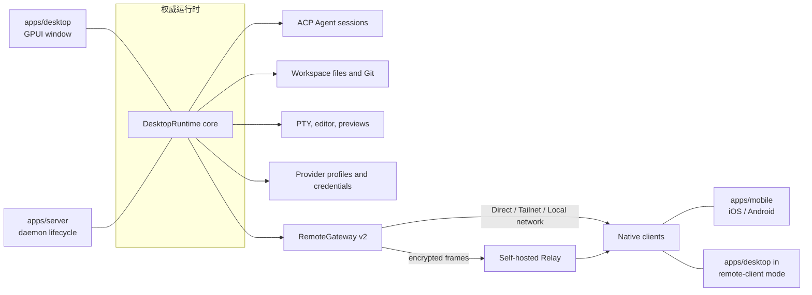

Vibex 通过"**权威运行时 + 类型化投影**"让多个原生客户端保持一致。不要在客户端、Relay 或 UI 层创建第二份权威业务状态。

## 运行时关系



关键点是**同一个 `DesktopRuntime` 内核有两种前端**：`apps/desktop` 给它加一个 GPUI 窗口，`apps/server` 给它加一套守护进程生命周期。两者暴露完全相同的 Remote v2 网关。

## 主要 crate 与 app

| 层 | 职责 |
| --- | --- |
| `crates/core` | 序列化 id、DTO、错误、能力和远程协议契约。 |
| `crates/db` | SQLite 持久化、迁移与查询。 |
| `crates/desktop-model` | 与框架无关的会话、时间线投影和 reducer。 |
| `crates/desktop-runtime` | 组装权威运行时：home 布局、通道身份、能力 facade。 |
| `crates/vibex-backend` | 原生与远程适配器共用的供应商无关能力 facade。 |
| `crates/vibex-ui` | 语义 token、可移植组件模型和工作流控制器。 |
| `crates/vibex-remote-client` | 配对、重连、同步和传输路由选择。 |
| `crates/agent` | Agent 会话管理与本地历史导入。 |
| `crates/agent-acp` | ACP 适配器、目录与运行时探测。 |
| `crates/agent-claude` / `crates/agent-codex` | 两个内建 Agent 的专用适配。 |
| `crates/fs` / `crates/git` / `crates/terminal` / `crates/content` | 文件、Git、PTY 与内容预览服务。 |
| `crates/remote` / `crates/relay` | Remote v2 网关与 Relay 契约。 |
| `crates/config-switch` | 配置导入导出、原生配置改写与密钥存储。 |
| `crates/backup` / `crates/diagnostics` | 备份恢复与脱敏诊断。 |
| `crates/app-update` | 签名自动更新。 |
| `crates/vibex-markdown` / `crates/vibex-terminal-ui` | Markdown 渲染与终端仿真。 |
| `apps/desktop` | 原生工作台；内嵌运行时。 |
| `apps/server` | 无头权威运行时 `vibex-server`。 |
| `apps/mobile` | 把共享远程投影组合成 Android / iOS 原生界面。 |
| `apps/relay-server` | 转发不透明的加密 WebSocket 帧。 |

## 数据流规则

事件带有权威序号和版本。客户端检测到 generation 或 cursor gap 时**必须**返回 `resync_required`，然后从权威运行时重新获取。文件写入还要遵循内容修订和 compare-and-swap（CAS）检查。

远程附件在建立流之前重新认证和授权。终端输入带工作区作用域、generation 检查和审计；不要保存原始终端字节。

## 项目与工作区模型

```text
ProjectRecord   { id, name, root_path }
  └── WorkspaceRecord { id, project_id, root_path, mode }   mode ∈ { CurrentCheckout, VibexWorktree }
        └── Session
```

一个项目对应多个工作区。`VibexWorktree` 工作区不是"另一种模式"，而是同一项目下的另一个工作区。

## 持久化和恢复

SQLite 保存项目、工作区、会话、时间线、供应商配置、终端元数据和远程设备。

**只存在于内存、重启即丢失：** Agent 进程、终端会话内容、活动连接。数据库中的 `running` 只是上次观察到的状态，重启后必须重新探测，丢失的终端标记为 `stale`。

## 变更评审清单

- 是否仍由权威运行时拥有唯一真相？
- 新能力是否同时支持本地与配对运行时（经 `BackendFacade`），而不是只走本地路径？
- 是否使用共享 DTO、错误和能力，而不是复制结构？
- 是否为重连、序号间隙、撤销和恢复定义行为？
- 是否脱敏日志、诊断资料和测试证据？

## 延伸阅读

- `docs/architecture/ui-boundary.md`
- `docs/remote/protocol-v2.md`
- `docs/platform/support-matrix.md`
- `docs/operations/recovery-matrix.md`
