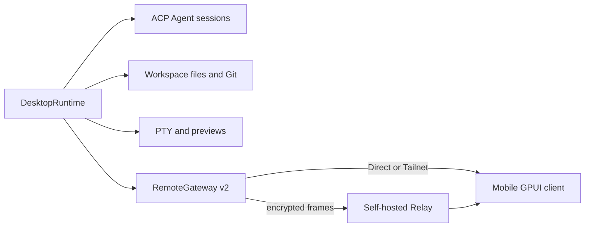

Vibex keeps native clients consistent with one authoritative runtime and typed projections. Do not create a second business state owner in mobile, Relay, or UI code.

## Runtime relationship

## Main crates

| Layer | Responsibility |
| --- | --- |
| `crates/core` | Serializable ids, DTOs, errors, capabilities, and remote contracts. |
| `crates/desktop-model` | Framework-independent session and timeline projections and reducers. |
| `crates/vibex-backend` | Provider-neutral capability facade shared by native and remote adapters. |
| `crates/vibex-ui` | Semantic tokens, portable component models, and workflow controllers. |
| `crates/vibex-remote-client` | Pairing, reconnect, sync, and Direct/Tailnet/Relay routing. |
| `apps/desktop` | Native workbench and `DesktopRuntime`. |
| `apps/mobile` | Native Android/iOS composition of shared remote projections. |
| `apps/relay-server` | Forwarding opaque encrypted WebSocket frames. |

Events carry authoritative sequence and version information. A generation or cursor gap must return `resync_required` and fetch authoritative state again. File writes use revision/CAS checks. Attachments and terminal input require authorization before opening and are audited.

SQLite stores projects, workspaces, sessions, timelines, providers, terminal metadata, and remote devices. `running` is not proof of a live process; a lost terminal becomes stale.

## Review checklist

- Is the desktop still the only source of truth?
- Are shared DTOs, errors, and capabilities used instead of copied structures?
- Are reconnect, sequence gaps, revocation, and recovery defined?
- Are logs, screenshots, and test evidence redacted?
