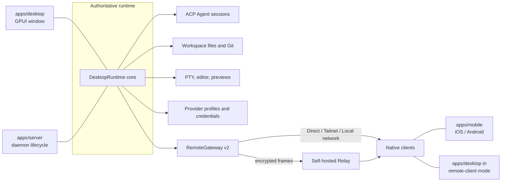

Vibex keeps multiple native clients consistent through an **authoritative runtime plus typed projections**. Do not create a second copy of authoritative business state in a client, Relay, or UI layer.

## Runtime relationships



The key point is that **one `DesktopRuntime` core has two frontends**: `apps/desktop` gives it a GPUI window, and `apps/server` gives it a daemon lifecycle. Both expose exactly the same Remote v2 gateway.

## Main crates and apps

| Layer | Responsibility |
| --- | --- |
| `crates/core` | Serializable ids, DTOs, errors, capabilities, and remote protocol contracts. |
| `crates/db` | SQLite persistence, migrations, and queries. |
| `crates/desktop-model` | Framework-independent session and timeline projections and reducers. |
| `crates/desktop-runtime` | Assembles the authoritative runtime: home layout, channel identity, and the capability facade. |
| `crates/vibex-backend` | Provider-neutral capability facade shared by native and remote adapters. |
| `crates/vibex-ui` | Semantic tokens, portable component models, and workflow controllers. |
| `crates/vibex-remote-client` | Pairing, reconnect, sync, and transport route selection. |
| `crates/agent` | Agent session management and local history import. |
| `crates/agent-acp` | ACP adapters, catalogs, and runtime probing. |
| `crates/agent-claude` / `crates/agent-codex` | Dedicated adaptation for the two built-in Agents. |
| `crates/fs` / `crates/git` / `crates/terminal` / `crates/content` | File, Git, PTY, and content preview services. |
| `crates/remote` / `crates/relay` | The Remote v2 gateway and Relay contracts. |
| `crates/config-switch` | Configuration import and export, native config rewriting, and secret storage. |
| `crates/backup` / `crates/diagnostics` | Backup and restore, plus redacted diagnostics. |
| `crates/app-update` | Signed automatic updates. |
| `crates/vibex-markdown` / `crates/vibex-terminal-ui` | Markdown rendering and terminal emulation. |
| `apps/desktop` | The native workbench; embeds the runtime. |
| `apps/server` | The headless authoritative runtime `vibex-server`. |
| `apps/mobile` | Composes shared remote projections into native Android / iOS interfaces. |
| `apps/relay-server` | Forwards opaque encrypted WebSocket frames. |

## Data flow rules

Events carry an authoritative sequence number and version. When a client detects a generation or cursor gap, it **must** return `resync_required` and then re-fetch from the authoritative runtime. File writes additionally follow content revision and compare-and-swap (CAS) checks.

Remote attachments re-authenticate and re-authorize before a stream is established. Terminal input carries workspace scope, generation checks, and auditing; never store raw terminal bytes.

## Project and workspace model

```text
ProjectRecord   { id, name, root_path }
  └── WorkspaceRecord { id, project_id, root_path, mode }   mode ∈ { CurrentCheckout, VibexWorktree }
        └── Session
```

A project maps to multiple workspaces. A `VibexWorktree` workspace is not "another mode" — it is another workspace under the same project.

## Persistence and recovery

SQLite stores projects, workspaces, sessions, timelines, provider profiles, terminal metadata, and remote devices.

**In memory only, lost on restart:** Agent processes, terminal session contents, and active connections. A `running` row in the database only reflects the last observed state; re-probe after a restart, and mark lost terminals as `stale`.

## Change review checklist

- Does the authoritative runtime still own the single source of truth?
- Does the new capability support both the local and the paired runtime (through `BackendFacade`), instead of only the local path?
- Does it use shared DTOs, errors, and capabilities instead of copying structures?
- Does it define behavior for reconnect, sequence gaps, revocation, and recovery?
- Are logs, diagnostics, and test evidence redacted?

## Further reading

- `docs/architecture/ui-boundary.md`
- `docs/remote/protocol-v2.md`
- `docs/platform/support-matrix.md`
- `docs/operations/recovery-matrix.md`
