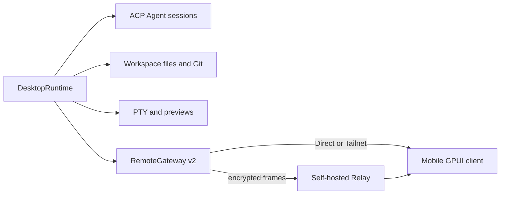

Vibex 以「單一權威執行環境 + 型別化投影」讓多個原生客戶端保持一致。不要在行動端、Relay 或 UI 層建立第二份權威業務狀態。

## 執行環境關係

## 主要 crate

| 層 | 職責 |
| --- | --- |
| `crates/core` | 序列化 id、DTO、錯誤、能力與遠端協議契約。 |
| `crates/desktop-model` | 與框架無關的會話、時間線投影和 reducer。 |
| `crates/vibex-backend` | 原生與遠端適配器共用的供應商無關 facade。 |
| `crates/vibex-ui` | 語意 token、可攜式元件模型和工作流程控制器。 |
| `crates/vibex-remote-client` | 配對、重連、同步和 Direct/Tailnet/Relay 路由。 |
| `apps/desktop` | 原生工作台和 `DesktopRuntime`。 |
| `apps/mobile` | 將共享遠端投影組合成 Android/iOS 原生介面。 |
| `apps/relay-server` | 轉發不透明的加密 WebSocket 框。 |

事件帶有權威序號與版本。發現 generation 或 cursor gap 時必須回傳 `resync_required` 並重新取得。檔案寫入遵循內容修訂與 CAS；附件和終端機輸入須在授權後建立並審計。

SQLite 保存專案、工作區、會話、時間線、Provider、終端機中繼資料和遠端裝置。資料庫中的 `running` 不是程序存活證明，遺失終端機要標記 stale。

## 變更審查清單

- 桌面端是否仍擁有唯一真相？
- 是否使用共享 DTO、錯誤和能力，而非複製結構？
- 是否定義重連、序號間隙、撤銷與恢復行為？
- 日誌、截圖和測試證據是否已脫敏？
