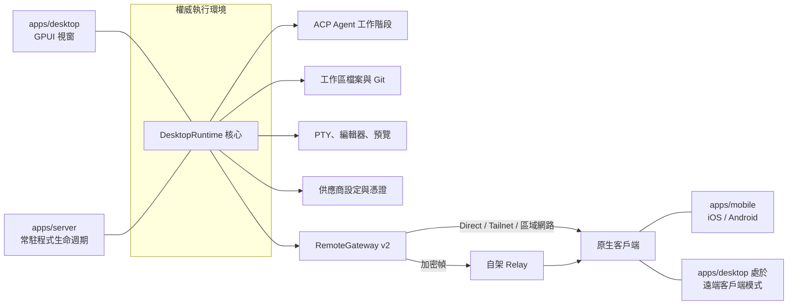

Vibex 透過「**權威執行環境 + 型別化投影**」讓多個原生客戶端保持一致。不要在客戶端、Relay 或 UI 層建立第二份權威業務狀態。

## 執行環境關係



關鍵點是**同一個 `DesktopRuntime` 核心有兩種前端**：`apps/desktop` 給它加上 GPUI 視窗，`apps/server` 給它一套常駐程式生命週期。兩者暴露完全相同的 Remote v2 閘道。

## 主要 crate 與 app

| 層 | 職責 |
| --- | --- |
| `crates/core` | 可序列化 id、DTO、錯誤、能力和遠端協議契約。 |
| `crates/db` | SQLite 持久化、遷移與查詢。 |
| `crates/desktop-model` | 與框架無關的會話、時間線投影和 reducer。 |
| `crates/desktop-runtime` | 組裝權威執行環境：home 佈局、通道身份、能力 facade。 |
| `crates/vibex-backend` | 原生與遠端適配器共用的供應商無關能力 facade。 |
| `crates/vibex-ui` | 語意 token、可攜元件模型和工作流程控制器。 |
| `crates/vibex-remote-client` | 配對、重連、同步和傳輸路由選擇。 |
| `crates/agent` | Agent 會話管理與本機歷史匯入。 |
| `crates/agent-acp` | ACP 適配器、目錄與執行環境探測。 |
| `crates/agent-claude` / `crates/agent-codex` | 兩個內建 Agent 的專用適配。 |
| `crates/fs` / `crates/git` / `crates/terminal` / `crates/content` | 檔案、Git、PTY 與內容預覽服務。 |
| `crates/remote` / `crates/relay` | Remote v2 閘道與 Relay 契約。 |
| `crates/config-switch` | 設定匯入匯出、原生設定改寫與金鑰儲存。 |
| `crates/backup` / `crates/diagnostics` | 備份恢復與脫敏診斷。 |
| `crates/app-update` | 簽章自動更新。 |
| `crates/vibex-markdown` / `crates/vibex-terminal-ui` | Markdown 渲染與終端機模擬。 |
| `apps/desktop` | 原生工作臺；內嵌執行環境。 |
| `apps/server` | 無頭權威執行環境 `vibex-server`。 |
| `apps/mobile` | 把共享遠端投影組合成 Android / iOS 原生介面。 |
| `apps/relay-server` | 轉發不透明的加密 WebSocket 幀。 |

## 資料流規則

事件帶有權威序號和版本。客戶端偵測到 generation 或 cursor 間隙時**必須**回傳 `resync_required`，然後從權威執行環境重新取得。檔案寫入還要遵循內容修訂和 compare-and-swap（CAS）檢查。

遠端附件在建立串流之前重新認證和授權。終端機輸入帶工作區作用域、generation 檢查和審計；不要保存原始終端機位元組。

## 專案與工作區模型

```text
ProjectRecord   { id, name, root_path }
  └── WorkspaceRecord { id, project_id, root_path, mode }   mode ∈ { CurrentCheckout, VibexWorktree }
        └── Session
```

一個專案對應多個工作區。`VibexWorktree` 工作區不是「另一種模式」，而是同一專案下的另一個工作區。

## 持久化和恢復

SQLite 保存專案、工作區、會話、時間線、供應商設定、終端機中繼資料和遠端裝置。

**只存在於記憶體、重新啟動即遺失：** Agent 程序、終端機會話內容、活動連線。資料庫中的 `running` 只是上次觀察到的狀態，重新啟動後必須重新探測，遺失的終端機標記為 `stale`。

## 變更審查清單

- 是否仍由權威執行環境擁有唯一真相？
- 新能力是否同時支援本機與配對執行環境（經由 `BackendFacade`），而不是只走本機路徑？
- 是否使用共享 DTO、錯誤和能力，而不是複製結構？
- 是否為重連、序號間隙、撤銷和恢復定義行為？
- 是否脫敏日誌、診斷資料和測試證據？

## 延伸閱讀

- `docs/architecture/ui-boundary.md`
- `docs/remote/protocol-v2.md`
- `docs/platform/support-matrix.md`
- `docs/operations/recovery-matrix.md`